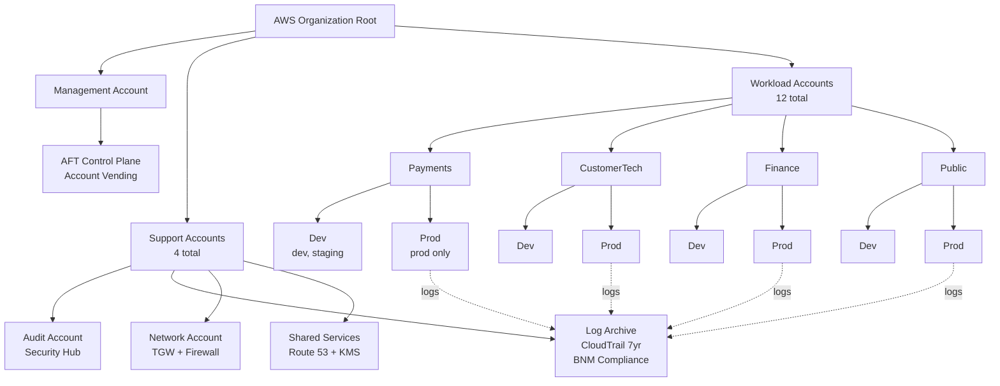
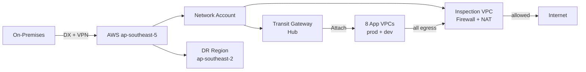
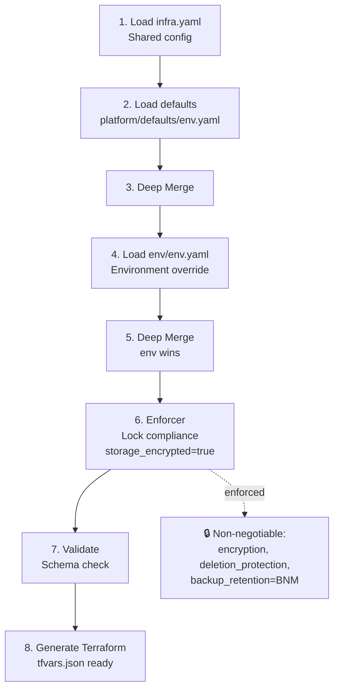
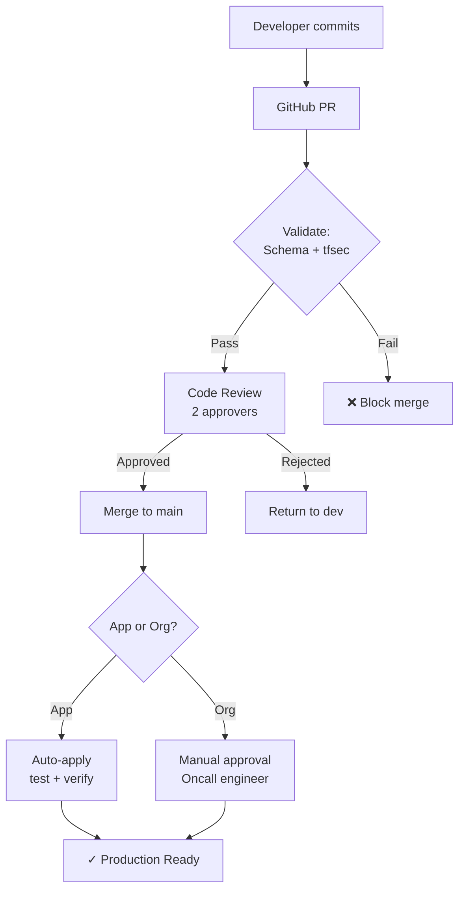
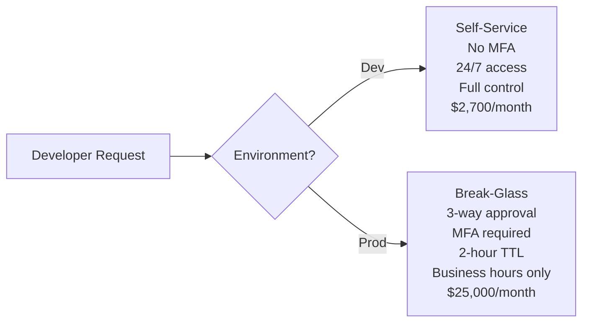
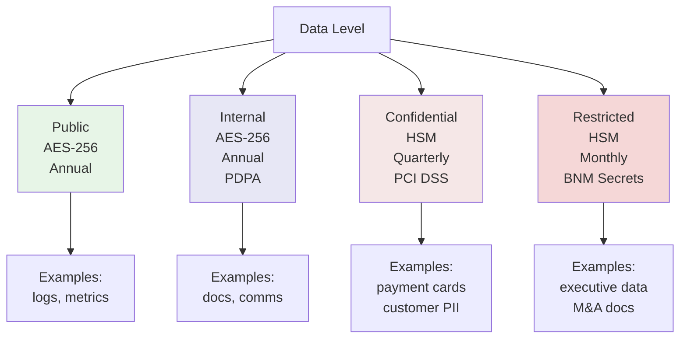

# Mbank Infrastructure Platform

Production-ready AWS landing zone with Terraform automation, compliance enforcement, and self-service infrastructure for application teams.

**Cloud Platform:** AWS | **Primary Region:** ap-southeast-5 (Kuala Lumpur) | **DR Region:** ap-southeast-2 (Sydney)

**Compliance:** BNM (7-year audit retention) | PCI DSS v3.2.1 (payment data) | PDPA (customer data)

---

## 🚀 Quick Start

### For Application Teams
```bash
# 1. Create your application directory
mkdir -p mbank-infra/applications/myapp/env

# 2. Define your infrastructure (shared config)
cat > mbank-infra/applications/myapp/infra.yaml << EOF
app: my-service
team: payments
cost_centre: CC-PAY-001
compute:
  type: ecs
  container_port: 8080
databases:
  - engine: aurora-postgresql
    storage_encrypted: true
features:
  waf: true
EOF

# 3. Define environment-specific overrides
cat > mbank-infra/applications/myapp/env/prod.yaml << EOF
environment: prod
data_classification: confidential
compute:
  cpu: 1024
  memory: 2048
  desired_count: 3
EOF

# 4. Submit PR
git add mbank-infra/applications/myapp/
git push origin feature/my-app
```

→ [Full Getting Started Guide](docs/getting-started.md)

### For Platform Teams
```bash
# 1. Plan infrastructure changes
cd mbank-infra/org
terraform plan

# 2. Review and apply
terraform apply

# 3. Monitor compliance
./platform/schema/validate.py applications/*/infra.yaml
```

---

## 📚 Documentation

### 🔗 Navigation Guide
**[→ START HERE: Documentation Navigation Guide](docs/NAVIGATION_GUIDE.md)** — Clickable index of all files, assessor roadmap, cross-document references

### Core References
- **[Account Strategy](docs/account-strategy.md)** — 2-account model per team, audit controls, access restrictions
- **[Mono-Repo Structure](docs/mono-repo-structure.md)** — Full layout, CODEOWNERS, application config split
- **[infra.yaml Reference](docs/infra-yaml-reference.md)** — Complete field reference with examples
- **[Platform Modules](docs/platform-modules.md)** — Available infrastructure modules, pricing, compliance mapping
- **[IaC Strategy](docs/iac-strategy.md)** — Terraform vs CDK decision, best practices, state management
- **[Getting Started](docs/getting-started.md)** — Onboarding guide for app teams

### AI Assistance & Developer Standards

- **[AI Assistance Documentation](docs/AI_ASSISTANCE.md)** — GitHub Copilot usage, areas of application, validation process
- **[Copilot Instructions](.copilot-instructions.md)** — Developer guidelines for consistent AI-assisted infrastructure code
- **[Compliance Standards](docs/control-matrix.md)** — Security guardrails enforced by pipeline screening

### Architecture & Diagrams

Mbank infrastructure is organized around a **2-account-per-team model** with a hub-and-spoke network topology, centralized configuration management, and multi-layer compliance enforcement.

→ **Full detailed diagrams and explanations:** [docs/diagrams.md](docs/diagrams.md)

#### 1. AWS Account Structure



**Key:** 16 total accounts (4 support + 12 workload). Prod accounts send immutable logs to Log Archive (BNM compliance). Each team has dev + prod separation. Cost savings: $960/year vs 12-account model.

#### 2. Network Topology: Hub-and-Spoke with Inspection VPC



**Key:** All egress traffic inspected by centralized Network Firewall. Impossible to bypass. DDoS detected centrally. 7-year audit trail of all blocked traffic.

#### 3. Configuration Merge Pipeline



**Key:** 100% compliance guaranteed before Terraform runs. Enforcer prevents encryption override. App teams can't bypass compliance.

#### 4. CI/CD Deployment Pipeline



**Key:** Multi-gate pipeline prevents misconfigs. Automated for app changes, manual gate for org/platform changes. All logged to CloudTrail (7-year retention).

#### 5. Dev vs Prod Access Control



**Key:** Zero standing access to prod. Dev is self-service for velocity. Prod is heavily gated for safety. Blast radius contained by time (2 hours), access (on-call only), and audit (7 years).

#### 6. Data Classification & KMS Mapping



**Key:** Encryption overhead scales with sensitivity. Restricted data uses monthly key rotation (minimizes exposure if breached). All decryption logged for 7 years (BNM compliance).

---

**→ Full detailed diagrams and explanations:** [docs/diagrams.md](docs/diagrams.md)

### Operations & Troubleshooting
- **[Drift Incident Runbook](docs/runbooks/drift-incident.md)** — Unauthorized route table change detection & recovery

---

## 📂 Repository Structure

```
mbank-infra/
├── org/                           Platform layer (teams: landing zone, network, security, shared services)
│   ├── management/aft/            AFT account vending (payments-dev/prod, customertech-dev/prod, etc.)
│   ├── management/organizations/  AWS Organizations, OUs, SCPs
│   ├── security/                  GuardDuty, Security Hub, CloudTrail, Config
│   ├── network/                   Transit Gateway, Network Firewall, Direct Connect
│   └── shared-services/           Route 53, ECR, KMS
│
├── platform/                      Reusable Terraform modules & defaults
│   ├── modules/                   11 modules: ecs-service, aurora, dynamodb, elasticache, s3, etc.
│   ├── defaults/                  Environment-specific config (prod, staging, dev)
│   └── schema/                    JSON schema validator, Python validation script
│
├── applications/                  App team infrastructure declarations (YAML only)
│   ├── payment/
│   │   ├── infra.yaml             (shared: app, team, compute.type, databases, features)
│   │   └── env/                   (environment-specific overrides)
│   │       ├── dev.yaml
│   │       ├── staging.yaml
│   │       └── prod.yaml
│   ├── customertech/, finance/, public/ (same structure)
│
├── pipeline/                      Generator, merger, enforcer, CI/CD scripts
│   ├── generator/                 Python orchestration (merger.py, enforcer.py, generator.py)
│   └── scripts/                   detect-changed-apps.sh, destroy-guard.sh
│
├── .github/workflows/             CI/CD pipeline
│   ├── org-plan.yml / org-apply.yml
│   └── app-validate.yml / app-plan.yml / app-apply.yml
│
└── docs/                          Documentation
    ├── getting-started.md
    ├── account-strategy.md
    ├── mono-repo-structure.md
    ├── infra-yaml-reference.md
    ├── platform-modules.md
    ├── iac-strategy.md
    ├── diagrams/
    ├── runbooks/
    └── completion-status.md
```

---

## 🏗️ Architecture Overview

### Account Structure (16 AWS Accounts)
```
Management Accounts (4):
  ├─ management-account (AFT control plane)
  ├─ audit-account (Security Hub, read-only)
  ├─ log-archive-account (CloudTrail 7-year retention)
  └─ network-account (TGW hub, firewall, shared DNS)

Workload Accounts (8):
  ├─ PaymentsBU-Dev (dev + staging, payments-team access)
  ├─ PaymentsBU-Prod (production only, on-call access, audit-heavy)
  ├─ CustomerTechBU-Dev, CustomerTechBU-Prod
  ├─ FinanceBU-Dev, FinanceBU-Prod
  └─ PublicBU-Dev, PublicBU-Prod
```

### Network Topology (Hub-and-Spoke)
```
On-Premises (10.0.0.0/8)
    ↓ AWS Direct Connect + VPN
Inspection VPC (100.64.0.0/16)
    ├─ Network Firewall (stateful rules)
    ├─ NAT Gateways (3 AZs)
    └─ Transit Gateway (routing hub)
         ├─ Spoke VPC: Payments (prod/dev)
         ├─ Spoke VPC: CustomerTech (prod/dev)
         ├─ Spoke VPC: Finance (prod/dev)
         └─ Spoke VPC: Public (prod/dev)
```

### Compliance Model
| Requirement | Implementation | Verification |
|------------|-----------------|--------------|
| **BNM Data Residency** | Primary region: ap-southeast-5 only | SCP region restriction |
| **7-Year Audit Trail** | CloudTrail 2555-day retention in log-archive | immutable, vault lock enabled |
| **PCI DSS** | Payment data (confidential) in encrypted KMS vault | enforcer locks encryption=true |
| **PDPA** | Customer data encrypted, access logged | VPC Flow Logs, CloudTrail |
| **HA (99.95%)** | Multi-AZ deployments, RTO=60min, RPO=15min | Aurora Multi-AZ, 35-day backups |

---

## 🔐 Governance & Access Control

### Production Access (Restricted)
```
Developer (need prod access)
    ↓
Request via Slack ticket #change-123
    ↓
On-call engineer reviews → approves
    ↓
STS AssumeRole with MFA requirement
    ↓
CloudTrail logs: who, what, when, why
    ↓
Change must be submitted via PR + approved
    ↓
CI/CD terraform apply (assume platform-ci role)
```

### Development Access (Self-Service)
```
Developer has direct access to dev account
    ↓
No approval required for dev/staging
    ↓
CloudTrail logs all actions (audit trail)
    ↓
Easy rollback via git + terraform
```

---

## 🛠️ Platform Modules (11 Total)

| Module | Purpose | Compliance |
|--------|---------|-----------|
| **ecs-service** | ECS Fargate, ALB, ECR, Auto Scaling | CloudWatch monitoring, X-Ray tracing |
| **ec2-autoscaling** | EC2 instances, ASG, SSM Session Manager | IMDSv2 required, encrypted EBS |
| **eks-workload** | Kubernetes namespace, IRSA, HPA | Network policies, resource quotas |
| **aurora** | PostgreSQL/MySQL, Multi-AZ, PITR | Encryption, 35-day backup minimum |
| **dynamodb** | NoSQL, auto-scaling, streams | PITR, cross-region replication |
| **elasticache** | Redis/Valkey, Multi-AZ, AUTH token | Encryption at-rest/in-transit, TLS |
| **s3-bucket** | Versioning, lifecycle, encryption | Public access blocked, MFA delete |
| **secrets** | Secrets Manager, policy-based access | KMS encryption, optional rotation |
| **waf** | AWS WAF v2, managed rules, rate limiting | OWASP Core Rule Set, geo-blocking |
| **monitoring** | CloudWatch dashboards, alarms, PagerDuty | SNS encrypted, log retention policies |
| **network** (org layer) | Transit Gateway, inspection VPC, firewall | All traffic inspected, DX + VPN backup |

See [Platform Modules Reference](docs/platform-modules.md) for full details.

---

##  Governance

### Code Review (CODEOWNERS)

**Platform Team Only:**
- `org/` — Changes to landing zone, network, security
- `platform/` — Changes to modules, schema, defaults
- `pipeline/` — Changes to generator, enforcer, CI/CD

**App Teams + Platform Review:**
- `applications/<team>/` — Team owns infra.yaml + env/*.yaml
  - 1 approval from team lead
  - 1 approval from platform team (security gate)

See [CODEOWNERS](CODEOWNERS) for full rules.

### Compliance Gate (Enforcer)

Every application change is validated by `enforcer.py`:
- ✓ encryption.at_rest = true (locked)
- ✓ encryption.in_transit = true (locked)
- ✓ Prod: deletion_protection = true (locked)
- ✓ Prod: multi_az = true (locked)
- ✓ Prod: backup_retention_days >= 35 (BNM: 2555 for prod)

### Audit Trail

**CloudTrail** logs every action:
```json
{
  "eventTime": "2026-09-21T14:32:15Z",
  "userIdentity": { "principalId": "payments-team@mbank.com" },
  "eventName": "AssumeRole",
  "sourceIPAddress": "192.0.2.1",
  "resources": [{ "ARN": "arn:aws:iam::123456789012:role/ProdDeveloper" }],
  "requestParameters": null,
  "responseElements": { "credentials": { "sessionToken": "***" } }
}
```

Archived to **log-archive-account** for 7-year retention (BNM requirement).

---

## 🚀 Deployment Pipeline

### Push → PR → Plan → Approve → Apply

```
Developer commits to feature/payment-api-v2
         ↓
GitHub PR triggers app-validate.yml
  ├─ Schema validation ✓
  ├─ Checkov security scan ✓
  ├─ Enforcer compliance check ✓
  └─ Comment: "✓ Ready for review"
         ↓
Reviewer approves PR
         ↓
Merge to main triggers app-plan.yml
  ├─ terraform plan
  ├─ Upload plan artifact
  └─ Comment: "terraform plan: 3 new, 2 modified, 0 destroyed"
         ↓
CD Approval Gate (manual)
  └─ On-call engineer: "Approve deployment"
         ↓
CI/CD runs app-apply.yml
  ├─ destroy-guard.sh (block if destroying protected resources)
  ├─ terraform apply
  ├─ Smoke test: curl ALB /health
  └─ CloudTrail log: "terraform apply by platform-ci@mbank.com"
         ↓
✅ Deployment complete
```

---

## 📞 Support & Escalation

| Issue | Contact | Escalation |
|-------|---------|-----------|
| App infra questions | @mbank/platform-team (Slack #platform-support) | Tech lead + Manager |
| Prod access request | security@mbank.com (ticket) | On-call lead (auto-escalate 2h) |
| Compliance violation | security@mbank.com | CISO + Legal |
| Emergency (prod down) | on-call: @mbank/payments-oncall | VP Engineering |

---

## 📝 License & Attribution

Copyright 2026 Mbank. All rights reserved.

**Key References:**
- AWS Well-Architected Framework
- AWS Landing Zone Accelerator
- HashiCorp Terraform Best Practices
- CIS AWS Foundations Benchmark

---

## 🤝 Contributing

1. **App teams:** Add infra.yaml + env/*.yaml in applications/
2. **Platform team:** Update org/, platform/, pipeline/ via RFC
3. All changes require PR review (see CODEOWNERS)
4. Automated validation gates prevent non-compliant deployments

See [Getting Started](docs/getting-started.md) for step-by-step guide.
