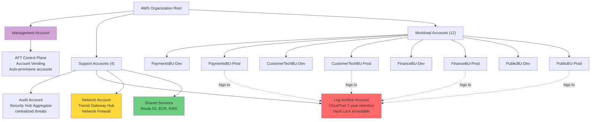
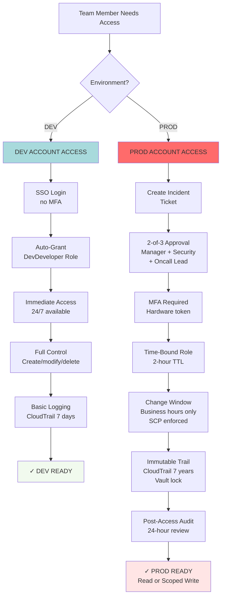
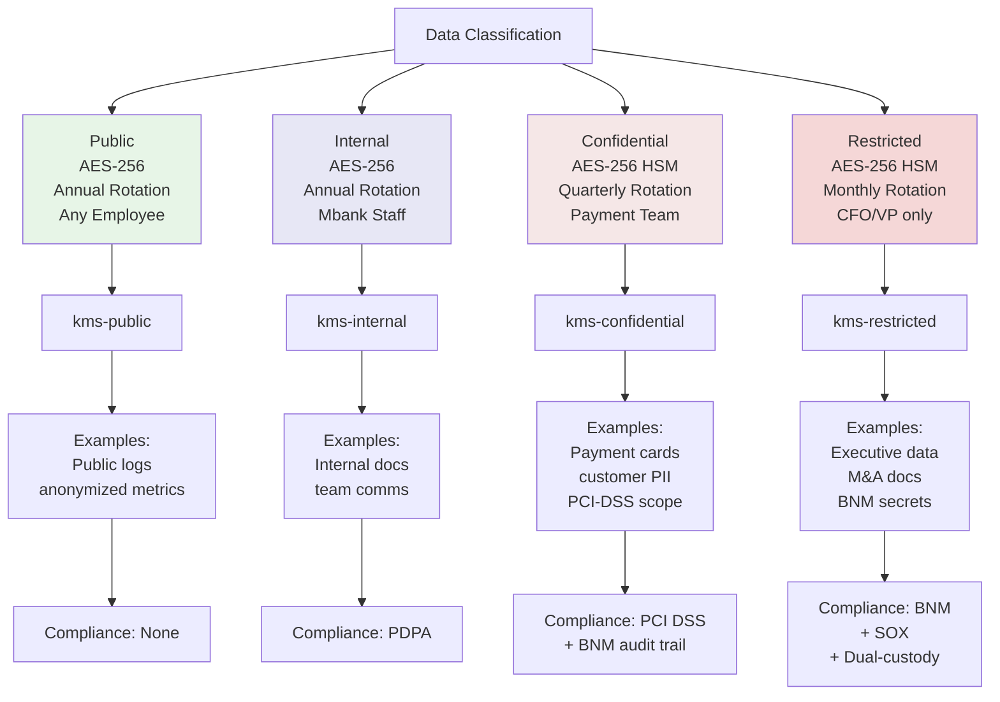

# AWS Account Strategy: 2-Account Model Per Team

## Overview

Mbank infrastructure is structured around a **2-account model per team** to optimize cost, audit separation, and access controls while maintaining operational simplicity.

---

## Account Architecture

### Total: 12 Workload Accounts + 4 Support Accounts = **16 AWS Accounts**

```
AWS Organization Root
│
├─ Support Accounts (4 shared, managed by platform team)
│  ├─ management-account
│  │  └─ AFT (Account Factory for Terraform) control plane
│  ├─ audit-account
│  │  └─ Security Hub aggregator, read-only reporting
│  ├─ log-archive-account
│  │  └─ Centralized CloudTrail, VPC Flow Logs (7-year retention for BNM)
│  └─ network-account
│     └─ Transit Gateway hub, Network Firewall, Direct Connect, shared DNS
│
└─ Workload Accounts (8 = 4 teams × 2 environments)
   ├─ PaymentsBU-Dev
   │  ├─ Environment: dev + staging
   │  ├─ OrgUnit: Workloads/PaymentsBU
   │  └─ Applications: payment-api (dev/staging)
   ├─ PaymentsBU-Prod
   │  ├─ Environment: prod
   │  ├─ OrgUnit: Workloads/PaymentsBU
   │  ├─ Applications: payment-api (prod)
   │  └─ Audit-Heavy: Restricted access, 2555-day CloudTrail, daily reports
   │
   ├─ CustomerTechBU-Dev
   │  ├─ Environment: dev + staging
   │  ├─ OrgUnit: Workloads/CustomerTechBU
   │  └─ Applications: crm-api (dev/staging)
   ├─ CustomerTechBU-Prod
   │  ├─ Environment: prod
   │  ├─ OrgUnit: Workloads/CustomerTechBU
   │  ├─ Applications: crm-api (prod)
   │  └─ Audit-Heavy: Restricted access, PDPA audit trail
   │
   ├─ FinanceBU-Dev
   │  ├─ Environment: dev + staging
   │  ├─ OrgUnit: Workloads/FinanceBU
   │  └─ Applications: finance-api (dev/staging)
   ├─ FinanceBU-Prod
   │  ├─ Environment: prod
   │  ├─ OrgUnit: Workloads/FinanceBU
   │  ├─ Applications: finance-api (prod)
   │  └─ Audit-Heavy: Restricted access, BNM + PCI DSS compliance
   │
   ├─ PublicBU-Dev
   │  ├─ Environment: dev + staging
   │  ├─ OrgUnit: Workloads/PublicBU
   │  └─ Applications: public-web (dev/staging)
   └─ PublicBU-Prod
      ├─ Environment: prod
      ├─ OrgUnit: Workloads/PublicBU
      ├─ Applications: public-web (prod)
      └─ Audit-Heavy: Restricted access, public-facing controls
```

---

## Visual: AWS Account Structure Hierarchy



**Key Points:**
- **16 total accounts:** 1 management + 4 support + 12 workload (4 teams × 2 environments)
- **All prod accounts** feed logs to centralized Log Archive (audit separation, compliance)
- **Network Account** owns TGW and Firewall (app teams have no network permissions)
- **AFT** auto-provisions new accounts following template (removes manual setup)

---

## Why 2-Account Model? (Strategic Rationale)

### Cost Optimization
- **8 workload accounts vs 12** = Save ~$960/year (AWS Organizations account overhead, per-account CloudTrail costs)
- Dev/staging combined reduces redundant infrastructure
- Shared network account centralizes TGW, firewall, DNS (multi-purpose cost per team: $0 incremental)

### Compliance & Audit Separation
| Aspect | Dev Account | Prod Account |
|--------|------------|--------------|
| **CloudTrail retention** | 7 days | 2555 days (7 years) — **BNM requirement** |
| **VPC Flow Logs retention** | 30 days | 90 days |
| **GuardDuty** | Disabled (cost) | **Enabled** (threat detection) |
| **Config Recorder** | Basic | Enhanced (all resources, all regions) |
| **Cost** | Minimal | Higher; cost-justified by compliance |

### Access Control Segregation
| Control | Dev/Staging | Production |
|---------|------------|-----------|
| **SSO Access** | Developers, QA | On-call only + break-glass |
| **MFA Requirement** | Optional | **Required** (SCP enforced) |
| **Change Window** | 24/7 | Business hours only (SCP) |
| **CloudTrail Log** | Basic | Immutable (vault lock), exported to log archive |
| **Break-Glass Role** | None (self-service) | Yes, with 4-eye approval + 2-hour audit trail |

## Access Control Flows: Dev vs Prod Parallel Paths



**Comparison:**

| Aspect | Dev | Prod |
|--------|-----|------|
| **Self-Service?** | Yes (instant) | No (break-glass ticket) |
| **MFA** | No | Yes (hardware token) |
| **Approval Gates** | None | 3-way (manager, security, lead) |
| **Time Limit** | Unlimited | 2 hours max (auto-revoke) |
| **Change Window** | 24/7 | Business hours only (SCP) |
| **Permissions** | Full admin | Read-only or scoped write |
| **Audit Trail** | Basic (7 days) | Immutable (7 years) |
| **Cost/Team** | ~$2,700/month | ~$25,000/month (audit overhead) |

> **Design Principle:** "Zero Standing Access" — No developer has permanent prod access. Every access is on-demand, time-limited, and audited.

### Blast Radius Containment
- Dev account failure = no production impact
- Staging failure = isolated to quality assurance
- Prod account restricted by SCP = limits damage from compromised developer credentials
- Network inspection via Firewall = all traffic inspected, DDoS mitigated centrally

---

## Account Provisioning & Governance

### AFT (Account Factory for Terraform)

Each account is vended via **Account Factory for Terraform (AFT)** with:

```bash
# Location: org/management/aft/account-requests/
# Files:
  - payments-dev.tf         ← Dev account request
  - payments-prod.tf        ← Prod account request
  - customertech-dev.tf
  - customertech-prod.tf
  - finance-dev.tf
  - finance-prod.tf
  - public-dev.tf
  - public-prod.tf
```

**Each account request includes:**
- AccountEmail (e.g., aws-payments-dev@mbank.com)
- AccountName (e.g., mbank-payments-dev)
- ManagedOrganizationalUnit (e.g., Workloads/PaymentsBU)
- SSO User setup
- Custom tags (environment, team, cost_centre, data_classification)

### Baseline Security Policies (Applied via AFT Customizations)

**AFT applies post-vend baselines to EVERY account:**

1. **IAM Roles:**
   - `ProdAdministrator` (prod only): Full access, requires MFA
   - `DevDeveloper`: Self-service access, no MFA
   - `ProdReadOnly`: Read-only prod access, for auditing
   - `BreakGlassRole`: Emergency access, 2-hour TTL, full audit logging

2. **S3 Bucket for Logs:**
   - Centralized logging bucket (created by AFT)
   - CloudTrail logs → S3 (encrypted with KMS)
   - VPC Flow Logs → S3 + CloudWatch

3. **VPC Defaults:**
   - Private subnets (compute, data)
   - Public subnets (ALB only, no direct internet resources)
   - VPC Flow Logs enabled → CloudWatch + S3
   - Network ACLs: egress restricted to ap-southeast-5, ap-southeast-2

## Data Classification & Compliance Mapping



**Key Retention & Rotation Schedules:**

| Classification | Encryption Key | Rotation | Audit Retention | Access Model |
|---|---|---|---|---|
| **Public** | kms-public | Annual | 7 days | Multi-tenant |
| **Internal** | kms-internal | Annual | 30 days | Mbank employees |
| **Confidential** | kms-confidential | Quarterly | 7 years (BNM) | Payment team + audit |
| **Restricted** | kms-restricted | Monthly | 7 years (immutable) | CFO + VP (dual-custody) |

**Compliance Requirements:**
- **BNM:** 7-year retention on confidential/restricted (CloudTrail immutable, vault lock)
- **PCI DSS v3.2.1:** Cardholder data encrypted (confidential tier), quarterly key rotation, access restricted
- **PDPA:** Customer data logged with consent (internal/confidential tiers), access auditable

> **Design Principle:** "Layered Encryption" — Overhead scales with sensitivity. Restricted uses HSM + dual-custody (expensive but necessary). Monthly rotation = even if key breached, max 1 month exposure.

---

4. **KMS Keys (by data classification):**
   - `kms-public`: Minimal encryption (S3 default)
   - `kms-internal`: Customer data encryption (PDPA)
   - `kms-confidential`: Payment data encryption (PCI DSS)
   - `kms-restricted`: Financial reporting (max protection)

---

## Production Account Access & Audit Controls

### Restricted Access Pattern (SCP + IAM)

**Step 1: Developer requests prod access**
```
Developer (AWS SSO) → Slack ticket #change-123
Platform team reviews → approves → grants ProdReadOnly role (1 hour TTL)
```

**Step 2: Accessing prod account**
```
Developer assumes ProdDeveloper role
  ↓
SCP evaluates: MFA present? ✓ | Business hours? ✓ | AWS region ap-southeast-5? ✓
  ↓
CloudTrail logs: Assume role → who, when, actions taken → audit trail
```

**Step 3: Making a change in prod**
```
Developer: terraform plan (read-only)
  ↓ Attaches plan to change ticket
  ↓ Platform engineer reviews + approves
  ↓ CI/CD runs terraform apply
  ↓ CloudTrail: apply executed by platform-ci@mbank.com
  ↓ SNS alert: "prod change applied, review audit log"
```

### SCP Policies (Production OUs)

**SCP: Require MFA for Prod Access**
```json
{
  "Version": "2012-10-17",
  "Statement": [
    {
      "Sid": "DenyAccessWithoutMFA",
      "Effect": "Deny",
      "Action": "sts:AssumeRole",
      "Resource": "arn:aws:iam::*:role/*Prod*",
      "Condition": {
        "Bool": { "aws:MultiFactorAuthPresent": "false" }
      }
    }
  ]
}
```

**SCP: Restrict changes to business hours**
```json
{
  "Version": "2012-10-17",
  "Statement": [
    {
      "Sid": "DenyOutOfHoursChanges",
      "Effect": "Deny",
      "Action": [
        "ec2:*", "rds:*", "s3:*", "iam:*", "kms:*", "dynamodb:*"
      ],
      "Resource": "*",
      "Condition": {
        "StringNotLike": {
          "aws:CurrentTime": [
            "2026-09-21T08:00:00Z",  // ← Business hours only
            "2026-09-21T17:00:00Z"
          ]
        }
      }
    }
  ]
}
```

### CloudTrail & Audit Trail (2555 days retention)

**Prod account:**
- **CloudTrail logs**: Immutable (S3 MFA delete enabled), encrypted with org KMS key
- **Vault Lock**: Applied to backup vault (prevents accidental deletion by admin)
- **Log Delivery**: Every 15 minutes to log-archive account
- **Analysis**: Athena queries for compliance reporting
  ```sql
  SELECT eventTime, userIdentity.principalId, eventName, sourceIPAddress
  FROM cloudtrail_logs
  WHERE eventName = 'AssumeRole'
  AND userIdentity.principalId LIKE '%@mbank.com'
  ORDER BY eventTime DESC
  ```

**Audit Reports (automated):**
- Daily: "Who accessed prod today?" (email to security-team@mbank.com)
- Weekly: Failed MFA attempts, root account usage
- Monthly: Cost analysis, unused resources, compliance posture

---

## Environment Characteristics

### Dev Account (PaymentsBU-Dev, etc.)
```yaml
# Configuration
environment: dev
account_name: mbank-{team}-dev
account_emails_allowed:
  - developers@{team}.mbank.com
  - qa@{team}.mbank.com

# Cloud Resources
compute:
  instance_type: t3.small  # Burstable
  min_instances: 1
  enable_xray: false

databases:
  - instance_class: db.t3.small  # Single node
    backup_retention: 0 days (no backup)
    multi_az: false

# Compliance
cloudtrail_retention_days: 7
vpc_flow_logs_retention_days: 30
guardduty_enabled: false
config_rules_enabled: false

# Cost
estimated_monthly_cost: $200-500/team
tags:
  Environment: dev
  CostAllocation: Team-Dev
```

### Staging in Dev Account (shared infrastructure)
```yaml
# Within the same account as dev, but separate deployment
environment: staging
compute:
  instance_type: t3.medium  # Slightly larger than dev
  min_instances: 2
  enable_xray: false

databases:
  - instance_class: db.r6g.medium  # Prod-like class
    backup_retention: 7 days
    multi_az: false  # Cost saving, but realistic setup

# Compliance
# Shares dev account's CloudTrail, Config rules
# But can have separate alarms + SNS topic

# Cost
estimated_monthly_cost: $300-600/team (dev + staging combined)
```

### Prod Account (PaymentsBU-Prod, etc.)
```yaml
# Configuration
environment: prod
account_name: mbank-{team}-prod
account_emails_allowed:
  - on-call-{team}@mbank.com
  - platform-ci@mbank.com  # CI/CD only

# Cloud Resources
compute:
  instance_type: t3.large (or optimized: c6g.xlarge)
  min_instances: 2
  enable_xray: true
  enable_x_ray_daemon_log: true

databases:
  - instance_class: db.r6g.large  # Prod-class
    backup_retention: 35 days (BNM minimum)
    multi_az: true  # HA requirement
    deletion_protection: true
    performance_insights: true

# Compliance
cloudtrail_retention_days: 2555 (7 years - BNM requirement)
vpc_flow_logs_retention_days: 90 (PCI DSS)
guardduty_enabled: true (threat detection)
config_rules_enabled: true (continuous compliance)
security_hub_enabled: true (aggregated findings)

# Cost
estimated_monthly_cost: $1,500-3,000/team/prod
tags:
  Environment: prod
  CostAllocation: Team-Prod
  ComplianceScope: [BNM, PCI DSS, PDPA]
```

---

## Data Classification Mapping

Each application's `data_classification` field (from infra.yaml) determines which KMS key is used:

| Classification | Scope | KMS Key | Prod Requirement |
|----------------|-------|---------|-----------------|
| **public** | Corporate website, non-sensitive | kms-public | No additional controls |
| **internal** | Customer data (CRM, preferences) | kms-internal | PDPA: encryption + access logs |
| **confidential** | Payment data (cards, transactions) | kms-confidential | **PCI DSS**: encryption + WAF + MFA |
| **restricted** | Financial reporting, audit logs | kms-restricted | **BNM**: encryption + immutable backups + 2555d retention |

Example for payment-api (confidential):
- Prod account: Uses `kms-confidential` key
- Dev/staging accounts: Also uses `kms-confidential` key (for realistic testing), but stored in dev account's KMS

---

## Cost Estimation (Annual, ap-southeast-5)

| Component | Dev/Staging | Prod | Notes |
|-----------|------------|------|-------|
| **AWS Account overhead** | $0 | $0 | Shared across orgs |
| **CloudTrail** | $2 (7 days) | $50 (2555 days) | Storage + analysis |
| **VPC Flow Logs** | $30 | $100 | S3 storage, Athena queries |
| **ECS Fargate (1 app)** | $2,500 | $12,000 | 1-3 tasks × CPU/memory |
| **Aurora (1 app)** | $0 (shared dev RDS) | $8,000 | Multi-AZ, backups, proxies |
| **GuardDuty** | $0 | $3,000 | Threat detection across accounts |
| **Security Hub** | $0 | $1,500 | Compliance aggregation |
| **KMS** | $200 | $500 | Key operations (dev, prod, shared) |
| **Total per team (1 app, annual)** | **~$2,700** | **~$25,000** | Varies by workload |

---

## Transition Plan

### Phase 1: Documentation (DONE)
- [x] Create this account-strategy.md
- [x] Update infra-yaml-reference.md with git_repo, contact_email, slo fields

### Phase 2: Application Config Restructuring
- [ ] Create env/ folders for all 4 applications
- [ ] Split infra.yaml → infra.yaml + env/{dev,staging,prod}.yaml
- [ ] Update generator.py to merge env/X.yaml

### Phase 3: AFT Account Provisioning
- [ ] Create new account requests in org/management/aft/account-requests/:
  - [ ] payments-dev.tf, payments-prod.tf
  - [ ] customertech-dev.tf, customertech-prod.tf
  - [ ] finance-dev.tf, finance-prod.tf
  - [ ] public-dev.tf, public-prod.tf
- [ ] Update organizations/main.tf with new OUs
- [ ] Run: `terraform init && terraform plan` (AFT management account)
- [ ] Run: `terraform apply` (AFT management account)

### Phase 4: Network & SCPs
- [ ] Update Transit Gateway route tables for Dev/Prod traffic separation
- [ ] Deploy SCP policies to Dev/Prod OUs
- [ ] Configure CloudTrail in prod accounts (2555-day retention)
- [ ] Test access restrictions (MFA, business hours)

### Phase 5: CI/CD Pipeline Validation
- [ ] Test generator.py with new env/*.yaml structure
- [ ] Validate app-plan/app-apply workflows
- [ ] Smoke test deployment to dev account
- [ ] Smoke test deployment to prod account (approval-gated)

---

## Break-Glass Access (Emergency)

**Scenario:** Production is down, on-call engineer needs immediate access.

**Procedure:**
1. On-call requests `BreakGlassRole` from Slack bot (auto-approved if on-call)
2. Role TTL = 2 hours
3. All actions logged to CloudTrail + audit SNS topic
4. Post-incident: Security team reviews audit trail within 1 business day
5. If misuse detected: Incident postmortem, access revoked

---

## Monitoring & Alerts

### Automated Alerts in Prod Accounts

**CloudWatch Alarms:**
- Unusual API activity (e.g., 100+ AssumeRole calls/hour)
- Root account usage detected
- Failed MFA attempts (>5 in 15 min)
- Data exfiltration patterns (large S3 downloads)

**SNS Notifications:**
- To: security-team@mbank.com, platform-team@mbank.com
- Subject: `[ALERT] Prod Account Activity: {alert_type}`
- Auto-escalate to PagerDuty for critical findings

---

## FAQ

**Q: Why not 1 account per environment per team (12 accounts instead of 8)?**
A: Cost ($960/yr overhead savings) + operational simplicity. Staging rarely needs isolation from dev in the same account if tagged properly.

**Q: Can we move to 12 accounts later?**
A: Yes, AFT can provision additional accounts anytime. Just add new .tf files in account-requests/. Existing infrastructure stays in place.

**Q: What if a developer accidentally deletes prod resources?**
A: CloudTrail + backup vault lock prevents permanent loss. We can restore from backup (Aurora: 35-day PITR, S3: versioning, DynamoDB: 35-day backups).

**Q: Who manages prod account access?**
A: Platform team (security@mbank.com) manages SCP policies. Team leads request access via ticket system. Break-glass is automated but audited.

**Q: How do we test a prod change before rolling out?**
A: Test in staging (dev account, prod-like config). Then use terraform plan (dry-run) in prod. Approve via CI/CD approval gate, then terraform apply.

---

## References

- [Getting Started](getting-started.md) — Onboarding new applications
- [infra-yaml-reference.md](infra-yaml-reference.md) — Application configuration schema
- [Platform Modules](platform-modules.md) — Available infrastructure modules
- [IaC Strategy](iac-strategy.md) — Terraform vs CDK decision
- [Implementation Status](completion-status.md) — Task checklist
