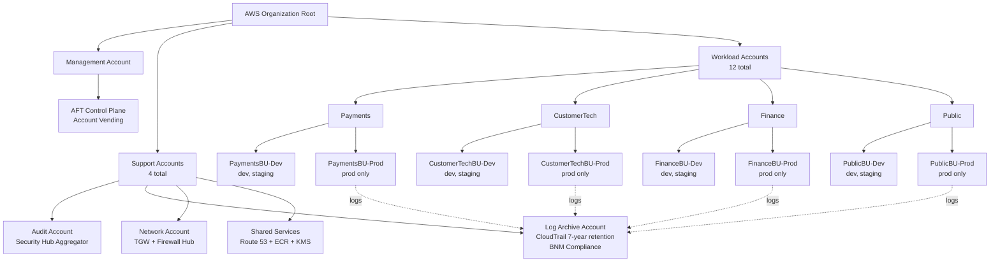
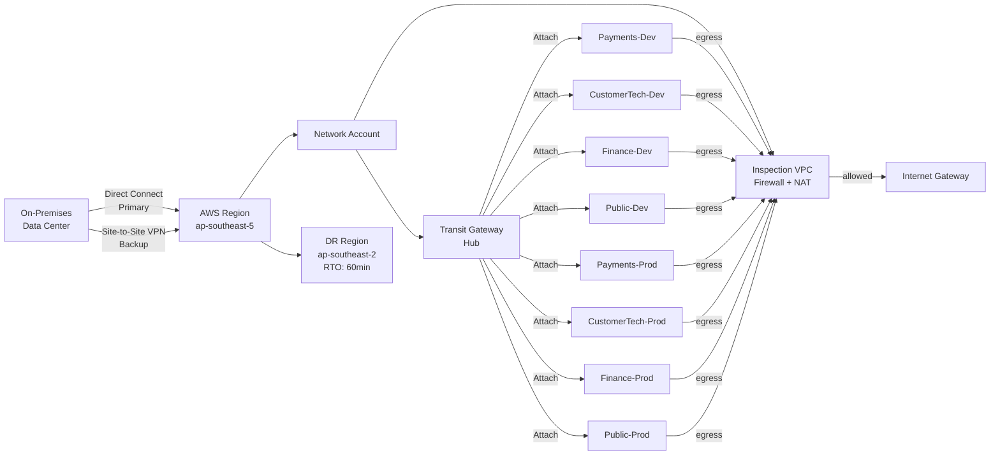
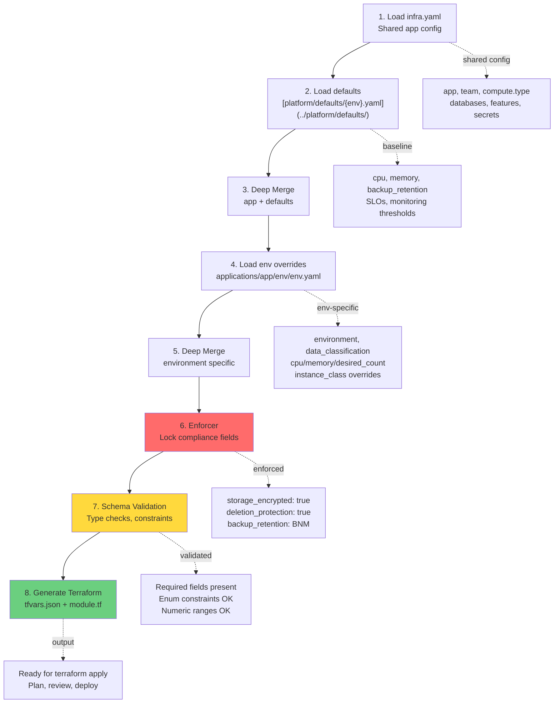
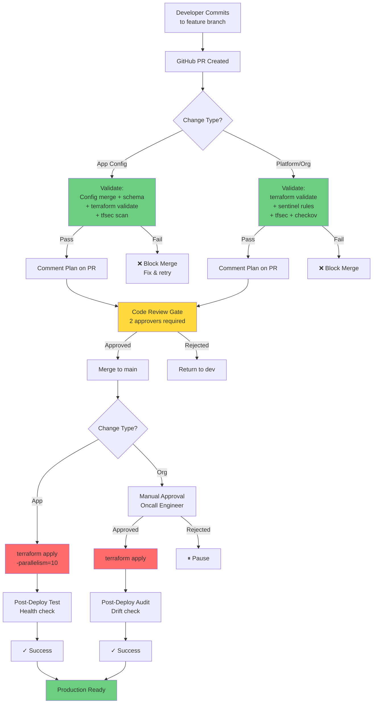
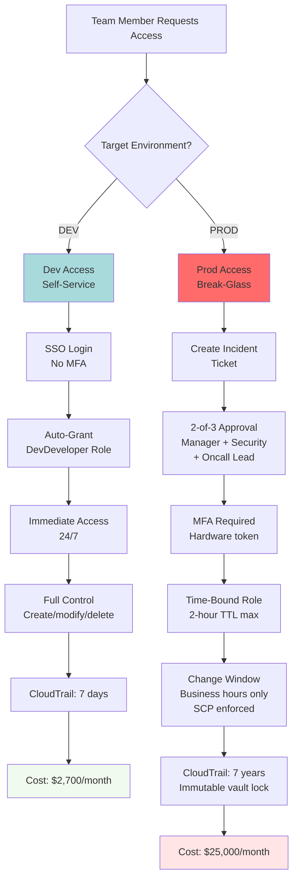
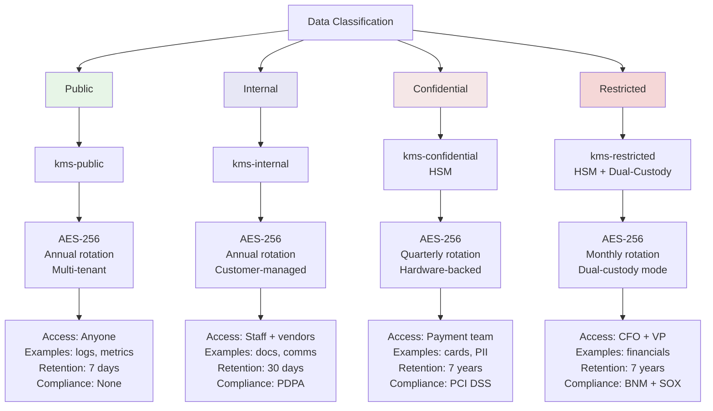

# Architecture & Diagrams

Comprehensive visual reference for Mbank's cloud infrastructure, account structure, deployment pipelines, and compliance controls.

**Quick Links:** [Account Strategy](account-strategy.md) | [Mono-Repo Structure](mono-repo-structure.md) | [Infra.yaml Reference](infra-yaml-reference.md) | [Platform Modules](platform-modules.md)

---

## Table of Contents

1. [AWS Account Structure](#1-aws-account-structure)
2. [Network Topology](#2-network-topology)
3. [Configuration Merge Pipeline](#3-configuration-merge-pipeline)
4. [CI/CD Deployment Flow](#4-cicd-deployment-flow)
5. [Dev vs Prod Access Control](#5-dev-vs-prod-access-control)
6. [Data Classification & KMS Mapping](#6-data-classification--kms-mapping)

---

## 1. AWS Account Structure

### Explanation: 2-Account Model Per Team

Mbank uses a **2-account-per-team model** to balance cost, audit separation, and operational simplicity.

**Why 2 accounts?**

| Factor | Benefit |
|--------|---------|
| **Cost** | 8 workload accounts (vs 12) saves ~$960/year (AWS Organizations overhead + CloudTrail per-account pricing). |
| **Audit Separation** | Dev/staging combined (basic logging); prod isolated with immutable 7-year CloudTrail (BNM requirement). |
| **Blast Radius** | Compromised dev account ≠ production risk. Prod restricted by SCP, time-bound access, change windows. |
| **Access Control** | Dev = self-service; Prod = break-glass only (2+ approvals, 2-hour TTL, MFA). |

**Structure Breakdown:**

| Component | Count | Purpose |
|-----------|-------|---------|
| **Management Account** | 1 | Org root. Hosts AFT control plane for account vending. No workloads. |
| **Support Accounts** | 4 | Shared infrastructure: Audit, Log Archive, Network, Shared Services |
| **Workload Accounts** | 12 | 4 business units × 2 environments each |
| **Total** | **16** | |

> **Compliance Mapping:**
> - **BNM:** 7-year retention enforced by Log Archive, immutable vault lock, audit role access
> - **PCI DSS:** Payment prod account isolated, HSM-backed keys, restricted access
> - **PDPA:** Customer data classified, access logged with consent metadata

---

## 2. Network Topology

### Hub-and-Spoke with Inspection VPC

### Explanation: Centralized Inspection & Egress Control

**On-Premises Connectivity:**
- **Direct Connect (Primary):** Low-latency dedicated connection for production traffic
- **Site-to-Site VPN (Backup):** Automatic failover during DX maintenance

**Transit Gateway (TGW):**
- Central routing hub managed by Network Account
- Connects all 8 app VPCs (prod/dev) to each other and on-prem
- TGW route tables enforce allowed flows

**Inspection VPC (Centralized Egress):**
- All outbound traffic routes through Inspection VPC
- **Network Firewall** inspects traffic:
  - Blocks known malware domains (threat intel feeds)
  - Drops suspicious ports (e.g., port 25 SMTP without approval)
  - Logs blocked attempts to CloudWatch
- **NAT Gateway** translates private IPs to single public IP

**Disaster Recovery (AP-SOUTHEAST-2):**
- Autonomous replication in Sydney
- **RTO:** 60 minutes (manual failover)
- **RPO:** 15 minutes (database replication lag)

**Traffic Flows:**

| Flow | Path | Security |
|------|------|----------|
| **East-West** | VPC→TGW→VPC | TGW route table, security groups |
| **Egress** | App VPC→Inspection VPC→Firewall→NAT→IGW | **Always inspected** (mandatory) |
| **Ingress** | On-Prem→DX/VPN→TGW→Spoke | Network Firewall optional |

> **Key Security Insights:**
> - **No direct internet access:** Every app route to 0.0.0.0/0 points to Inspection VPC (impossible to bypass)
> - **Centralized logging:** All firewall blocks logged to CloudWatch → CloudTrail → Log Archive (7-year BNM retention)
> - **DDoS mitigation:** Network Firewall detects/drops DDoS patterns; AWS Shield Standard at perimeter
> - **Compliance:** PCI DSS requirement for "network-layer protection" satisfied

---

## 3. Configuration Merge Pipeline

### From infra.yaml to Terraform in 8 Steps

### Explanation: Self-Service Without Configuration Risk

**Why This Pipeline?**

Traditional approaches:
1. **Manual Terraform:** App teams write .tf files → compliance violations risk
2. **Centralized Platform:** Platform writes all Terraform → slow bottleneck

Mbank's **hybrid approach** gives teams self-service while enforcing compliance automatically.

**Step-by-Step:**

| Step | What Happens | Example |
|------|--------------|---------|
| **1. Load Shared** | App's infra.yaml | app: payment-api, team: payments |
| **2. Load Defaults** | Platform baseline for env | For prod: cpu 1024, backup 35d (BNM) |
| **3. Deep Merge** | Combine (app overrides defaults) | App wanted 512 CPU, defaults bump to 1024 |
| **4. Load Env** | Environment-specific overrides | applications/payment/env/prod.yaml loaded |
| **5. Deep Merge** | Env overrides app+defaults | Final: cpu 1024 (prod env wins) |
| **6. Enforcer** | Compliance rules applied | storage_encrypted: false attempted → overridden to true |
| **7. Validate** | Check schema | Required fields present? CPU in range? |
| **8. Generate** | Create Terraform files | tfvars.json + module.tf ready for CI/CD |

**Key Insight — The Enforcer Step:**

Compliance rules are **non-negotiable:**
- `storage_encrypted` must be true (always)
- `deletion_protection` must be true (prod)
- `backup_retention` must follow BNM rules (7 days dev, 2555 days prod)

If app team submits `storage_encrypted: false` → enforcer overrides to `true`, logs violation.

**Zero compliance drift guaranteed.**

**Merge Priority (Left-to-Right):**
1. **Lowest:** [platform/defaults/{env}.yaml](../platform/defaults/) (org baseline)
2. **Medium:** [applications/{app}/infra.yaml](../applications/) (app definition)
3. **Highest:** [applications/{app}/env/{env}.yaml](../applications/) (environment override)

> **Example:** Payment API team:
> 1. Creates [applications/payment-api/env/prod.yaml](../applications/payment/env/prod.yaml) with cpu: 1024
> 2. Pipeline merges with platform/defaults/prod.yaml
> 3. Enforcer locks encryption=true, backup_retention=2555d (BNM)
> 4. Output: terraform.tfvars.json + module.tf ready to deploy
> 5. **100% BNM-compliant before CI runs.**

---

## 4. CI/CD Deployment Flow

### Multi-Gate Pipeline: Validate → Review → Plan → Approve → Apply

### Explanation: Multiple Gates Prevent Misconfigurations

**Validation Stage (Pre-Merge):**
- **App Config:** Config merge → terraform validate → tfsec security scan
- **Org/Platform:** terraform validate → Sentinel policies → tfsec + checkov
- If any step fails: PR merge blocked

**Code Review Gate (Pre-Merge):**
- Requires **2 approvers** (prevents single-person mistakes)
- Auditable approval trail (name, timestamp, comments)

**Deployment Stage (Post-Merge):**
- **App Config:** Auto-applies to dev/staging, review before prod
- **Org/Platform:** Requires manual approval from on-call engineer (higher bar for critical infra)

**Change Windows (SCP Enforced):**
- **Prod:** Business hours only (9-5 Mon-Fri)
- **Dev/staging:** 24/7

**Audit Trail:**
- Every deployment logged to CloudTrail with who/when/what/why
- Retention: 7 years (BNM compliance)
- Immutable: vault lock prevents deletion

> **Compliance Alignment:**
> - **BNM:** "All changes must be auditable" ✓ (7-year CloudTrail)
> - **PCI DSS:** "Segregation of duties" ✓ (dev/prod separate, approval gates)
> - **PDPA:** "Change authorization" ✓ (2 approvers, logged)

---

## 5. Dev vs Prod Access Control

### Zero Standing Access Model

### Explanation: "Zero Standing Access" Principle

**Why Not Always-On Prod Access?**

Always-on access = perpetual risk (compromised credentials = instant prod access).

**The Solution: Zero Standing Access**
- No developer has permanent prod access
- Access granted only on-demand, time-limited, audited
- Unauthorized access requires defeating multiple gatekeepers

**Development Account:**

| Aspect | Detail |
|--------|--------|
| **Approval** | SSO/IAM (automated, no human) |
| **Role** | DevDeveloper (PowerUser) |
| **MFA** | No (speeds iteration) |
| **Hours** | 24/7 |
| **Permissions** | Create, modify, delete |
| **Audit Trail** | CloudTrail (7 days, basic) |
| **Blast Radius** | Limited to dev; no prod impact |

**Production Account:**

| Aspect | Detail |
|--------|--------|
| **Approval** | 3-way committee (manager, security, oncall) |
| **Role** | ProdReadOnly or scoped write |
| **MFA** | Yes (hardware token) |
| **Hours** | Business hours only (SCP) |
| **Duration** | Max 2 hours (TTL) |
| **Permissions** | Read-only OR scoped write |
| **Audit Trail** | CloudTrail (7 years, immutable vault lock) |
| **Post-Review** | Security team audits within 24 hours |

**Access Control Comparison:**

| Requirement | Dev | Prod |
|-------------|-----|------|
| **Self-Service?** | Yes | No (break-glass ticket) |
| **MFA** | No | Yes |
| **Approval Gates** | None | 3-way approval |
| **Time Limit** | Unlimited | 2 hours max |
| **Change Window** | 24/7 | Business hours (SCP) |
| **Permissions** | Full admin | Read or scoped |
| **Audit Trail** | Basic (7d) | Immutable (7y) |

> **Design Principle:** Multiple layers of protection so no single failure compromises production. Dev is self-service (velocity). Prod is heavily gated (safety).

---

## 6. Data Classification & KMS Mapping

### 4-Level Encryption Hierarchy

### Explanation: Layered Encryption Controls

**Why 4 Classification Levels?**

Aligns encryption overhead with risk level. Too much encryption = cost + performance overhead. Too little = compliance failures.

**Classification Framework:**

| Level | Sensitivity | Encryption | Rotation | Access | Retention |
|-------|-------------|------------|----------|--------|-----------|
| **Public** | Low | AES-256 | Annual | Anyone | 7 days |
| **Internal** | Medium | AES-256 | Annual | Staff + vendors | 30 days |
| **Confidential** | High | AES-256 (HSM) | Quarterly | Payment team | 7 years (BNM) |
| **Restricted** | Critical | AES-256 (HSM + dual-custody) | Monthly | CFO + VP | 7 years (immutable) |

**1. Public Data**
- **Uses:** Public-facing API logs, anonymized metrics, marketing assets
- **Key:** kms-public (multi-tenant)
- **Rotation:** Annual
- **Access:** Any Mbank employee
- **Retention:** 7 days (can delete after 1 week)
- **Compliance:** No special requirement

**2. Internal Data**
- **Uses:** Documentation, non-customer analytics, team communications
- **Key:** kms-internal (customer-managed)
- **Rotation:** Annual
- **Access:** Mbank employees + approved vendors (B2B partners)
- **Retention:** 30 days (PDPA-scoped)
- **Compliance:** PDPA (internal-only data)

**3. Confidential Data (PCI DSS Scope)**
- **Uses:** Payment cards (PANs), transaction logs, customer PII
- **Key:** kms-confidential (HSM-backed, FIPS 140-2 Level 2)
- **Rotation:** Quarterly (every 3 months; shorter window = less exposure if breached)
- **Access:** Payment team + audit role (read-only)
- **Retention:** **7 years (BNM requirement)**
- **Compliance:** PCI DSS v3.2.1 Requirement 3.4 (encryption at-rest/in-transit)

**4. Restricted Data (Executive & Bank Secrets)**
- **Uses:** Financial reports, M&A documents, regulatory filings, executive compensation
- **Key:** kms-restricted (HSM-backed, FIPS 140-2 Level 3, dual-custody mode)
- **Rotation:** Monthly (highest frequency; minimizes exposure)
- **Access:** CFO + Finance VP only (dual-custody: both must present keys)
- **Retention:** **7 years (immutable, vault lock)**
- **Compliance:** BNM bank secrets + US SOX (if applicable)

**Key Rotation & Access Patterns:**

| Tier | How Often | Why | Who Can Decrypt |
|------|-----------|-----|-----------------|
| **Public** | Annual | Low sensitivity | Public (anyone) |
| **Internal** | Annual | Mbank-confidential | Employees + vendors |
| **Confidential** | Quarterly (3-month) | PCI DSS (payment cards) | Payment team + audit |
| **Restricted** | Monthly | Executive secrets | CFO + VP (dual-custody) |

**Post-Decryption Controls:**

Once data is decrypted in memory, it's subject to application-layer controls:
- Payment API reads card PAN from encrypted storage → processes transaction → re-encrypts before returning to client
- VPC security groups restrict network access to databases
- Application logs scrubbed (never log unencrypted card data)

> **Key Security Principles:**
> - **Layered Defense:** Different keys for different sensitivity levels
> - **Principle of Least Privilege:** Only people who need to decrypt can access
> - **Audit Everything:** Every decrypt logged for 7 years (BNM compliance)
> - **Minimize Exposure:** Monthly rotation on restricted keys = max 1 month of exposure if breached
> - **Compliance by Design:** Encryption enforced by platform (enforcer step)

**Cost Estimate (Per Account, Per Month):**

| Key | Usage | Cost |
|-----|-------|------|
| kms-public | Shared across apps | $0.03 |
| kms-internal | Shared across apps | $1.00 |
| kms-confidential | Dedicated payment | $5.00 + egress |
| kms-restricted | Dedicated finance | $15.00 + audit overhead |
| **Total baseline** | | ~$21/month + usage |

---

## Related Documentation

- **[Account Strategy](account-strategy.md)** — 2-account model, access control, costs
- **[Platform Modules](platform-modules.md)** — Pricing, features per module
- **[Mono-Repo Structure](mono-repo-structure.md)** — Application config layout
- **[infra.yaml Reference](infra-yaml-reference.md)** — Complete schema
- **[IaC Strategy](iac-strategy.md)** — Terraform vs CDK decision
- **[Getting Started](getting-started.md)** — Onboarding for app teams
- **[Drift Incident Runbook](runbooks/drift-incident.md)** — Detection & recovery
