# Platform Modules Reference

Complete reference for Mbank infrastructure platform modules. Each module is a reusable Terraform package that provisions specific AWS services based on application requirements.

---

## ECS Service Module

**Location:** [platform/modules/ecs-service/](../platform/modules/ecs-service/)

### What It Provisions
- ECS Fargate cluster with container orchestration
- Application Load Balancer (ALB) for traffic distribution
- CloudWatch log group for application logs
- ECR repository for container images with scanning
- IAM roles and policies for task execution and app access
- CloudWatch alarms for monitoring (CPU, memory, error rates)
- Auto-scaling based on CPU utilization (70% target)
- Optional: RDS Proxy, X-Ray tracing, Secrets Manager integration

### When Used
- **Trigger:** `applications/*/infra.yaml` with `compute.type: ecs`
- **Ideal for:** Containerized microservices, APIs, stateless workloads
- **Examples:** payment-api, crm-api, finance-api, public-web

### Key Variables
| Variable | Type | Default | Description |
|----------|------|---------|-------------|
| `app_name` | string | — | Application identifier |
| `environment` | string | — | Deployment environment (prod/staging/dev) |
| `container_image` | string | — | ECR image URI |
| `container_port` | number | 8080 | Container port for app |
| `cpu` | number | 512 | Task CPU units |
| `memory` | number | 1024 | Task memory (MB) |
| `desired_count` | number | 2 | Number of tasks |
| `min_capacity` | number | 1 | Minimum for autoscaling |
| `max_capacity` | number | 10 | Maximum for autoscaling |
| `public_facing` | bool | false | Internet-facing ALB? |
| `enable_xray` | bool | false | X-Ray tracing? |

### Module Outputs
- `alb_dns_name` — Load balancer DNS for application access
- `ecs_cluster_name` — Cluster name (for kubectl config, if applicable)
- `ecr_repository_url` — ECR repo URL for pushing images
- `service_sg_id` — Security group for the service

### Pricing Estimate (ap-southeast-5, prod, monthly)

| Component | Quantity | Unit Price | Total |
|-----------|----------|-----------|-------|
| Fargate (vCPU) | 3 tasks × 1 vCPU × 730h | $0.06/h | $131.40 |
| Fargate (Memory) | 3 tasks × 2GB × 730h | $0.013/h | $56.78 |
| ALB | 1 × 730h | $16.20/month | $16.20 |
| CloudWatch Logs | ~5GB/month | $0.50/GB | $2.50 |
| **Total** | | | **~$207/month** |

---

## EC2 Auto Scaling Module

**Location:** [platform/modules/ec2-autoscaling/](../platform/modules/ec2-autoscaling/)

### What It Provisions
- Auto Scaling Group (ASG) across 3 AZs for high availability
- EC2 Launch Template with IMDSv2 enforcement, encrypted EBS
- Internal Application Load Balancer for instance management
- Systems Manager Session Manager for secure SSH-less access
- CloudWatch agent for metrics and logging
- IAM instance profile with minimal permissions
- Auto-scaling policies (CPU-based target tracking)
- CloudWatch alarms for scaling and health

### When Used
- **Trigger:** `applications/*/infra.yaml` with `compute.type: ec2`
- **Ideal for:** Legacy applications, specialized workloads requiring EC2 (Java apps, databases)
- **Note:** Not typical for Mbank; ECS Fargate preferred

### Key Variables
| Variable | Type | Default | Description |
|----------|------|---------|-------------|
| `instance_type` | string | `t3.medium` | EC2 instance type |
| `min_size` | number | 2 | Minimum instances |
| `max_size` | number | 10 | Maximum instances |
| `desired_capacity` | number | 2 | Target instances |
| `enable_ssm` | bool | true | SSM Session Manager? |

### Module Outputs
- `alb_dns_name` — Load balancer DNS
- `asg_name` — Auto Scaling Group name
- `instance_sg_id` — Security group

### Pricing Estimate (ap-southeast-5, prod, t3.medium, monthly)

| Component | Quantity | Unit Price | Total |
|-----------|----------|-----------|-------|
| EC2 t3.medium | 2 × 730h | $0.052/h | $76.02 |
| EBS gp3 (30GB) | 2 × 30GB × $0.10/GB/month | $0.10/GB | $6.00 |
| ALB | 1 × 730h | $16.20/month | $16.20 |
| **Total** | | | **~$98/month** |

---

## EKS Workload Module

**Location:** [platform/modules/eks-workload/](../platform/modules/eks-workload/)

### What It Provisions
- Kubernetes namespace with resource quotas and limits
- IAM role for pod identity (IRSA - IAM Roles for Service Accounts)
- ServiceAccount annotated with IRSA role ARN
- Network policies (default deny + allow same namespace + kube-system)
- Horizontal Pod Autoscaler (HPA) v2 with CPU/memory targets
- SSM parameters exporting namespace, service account, role ARN

### When Used
- **Trigger:** `applications/*/infra.yaml` with `compute.type: eks`
- **Ideal for:** Kubernetes-native applications, microservices mesh, Helm deployments
- **Note:** EKS cluster provisioned separately (not by this module)

### Key Variables
| Variable | Type | Default | Description |
|----------|------|---------|-------------|
| `namespace` | string | — | Kubernetes namespace name |
| `service_account_name` | string | — | ServiceAccount name |
| `hpa_min_replicas` | number | 2 | Minimum pod replicas |
| `hpa_max_replicas` | number | 10 | Maximum pod replicas |
| `hpa_cpu_target` | number | 70 | CPU utilization % for scaling |
| `iam_policy_arns` | list(string) | [] | IAM policies to attach |

### Module Outputs
- `irsa_role_arn` — IAM role for pod identity
- `namespace` — Kubernetes namespace
- `service_account_name` — ServiceAccount name

### Pricing Estimate (included in EKS cluster, no additional cost per namespace)

---

## Aurora RDS Module

**Location:** [platform/modules/aurora/](../platform/modules/aurora/)

### What It Provisions
- RDS Aurora cluster (MySQL or PostgreSQL) with Multi-AZ deployment
- Cluster instances (1 writer + N readers) with failover promotion
- Encryption with KMS customer-managed key
- Automated backups with point-in-time recovery (PITR)
- Enhanced monitoring (60-second granularity) and Performance Insights
- CloudWatch logs for error/general/slow queries
- Optional RDS Proxy for connection pooling
- AWS Backup plan with 35-day retention + cross-region copy (prod)
- Secrets Manager for master password with auto-rotation

### When Used
- **Trigger:** `applications/*/infra.yaml` with `databases[*].engine: aurora-postgresql|aurora-mysql`
- **Ideal for:** Relational data, ACID transactions, complex queries
- **Compliance:** BNM requires 7-year audit, enforcer sets 35-day minimum backups

### Key Variables
| Variable | Type | Default | Description |
|----------|------|---------|-------------|
| `engine` | string | `aurora-postgresql` | Aurora engine version |
| `instance_class` | string | `db.r6g.large` | Instance size |
| `num_instances` | number | 3 | Writer + reader count |
| `backup_retention_days` | number | 35 | Backup retention (prod minimum) |
| `enable_rds_proxy` | bool | false | Enable connection pooling? |

### Module Outputs
- `cluster_endpoint` — Writer endpoint (for writes)
- `reader_endpoint` — Reader endpoint (for read-only queries)
- `secret_arn` — Secrets Manager secret for password

### Pricing Estimate (ap-southeast-5, prod, aurora-postgresql, db.r6g.large, 3 instances, monthly)

| Component | Quantity | Unit Price | Total |
|-----------|----------|-----------|-------|
| Aurora instance | 3 × $0.38/h × 730h | $0.38/h | $834.00 |
| Aurora storage | 500GB × $0.20/GB/month | $0.20/GB | $100.00 |
| Backup storage | 350GB × $0.095/GB/month | $0.095/GB | $33.25 |
| Enhanced monitoring | 1 × $1.50/h × 730h | $1.50/h | $1095.00 |
| **Total** | | | **~$2,062/month** |

---

## DynamoDB Module

**Location:** [platform/modules/dynamodb/](../platform/modules/dynamodb/)

### What It Provisions
- DynamoDB table with KMS encryption and PITR
- Global secondary indexes (GSI) for query flexibility
- On-demand or provisioned billing with auto-scaling
- Streams for CDC (Change Data Capture) to Lambda/Kinesis
- Cross-region replica to Sydney (prod only) for DR
- CloudWatch alarms for throttling and user errors
- AWS Backup plan with 35-day retention

### When Used
- **Trigger:** `applications/*/infra.yaml` with `databases[*].engine: dynamodb`
- **Ideal for:** NoSQL workloads, high-throughput key-value, schemaless data
- **Examples:** Session store, user preferences, activity logs

### Key Variables
| Variable | Type | Default | Description |
|----------|------|---------|-------------|
| `table_name` | string | — | DynamoDB table name |
| `hash_key` | string | — | Partition key |
| `range_key` | string | — | Sort key (optional) |
| `billing_mode` | string | `PAY_PER_REQUEST` | On-demand or PROVISIONED |
| `enable_streams` | bool | false | Enable DynamoDB Streams? |
| `global_secondary_indexes` | list | [] | List of GSI definitions |

### Module Outputs
- `table_arn` — Table ARN for IAM policies
- `table_name` — Table name

### Pricing Estimate (ap-southeast-5, prod, on-demand with 1M RCU + 1M WCU/month)

| Component | Quantity | Unit Price | Total |
|-----------|----------|-----------|-------|
| Write units | 1M/month | $1.25 per 1M WCU | $1.25 |
| Read units | 1M/month | $0.25 per 1M RCU | $0.25 |
| Stream | 1M records/month | $0.02 per 100k | $0.20 |
| Backup storage | 5GB × $0.25/GB/month | $0.25/GB | $1.25 |
| **Total** | | | **~$3/month** (on-demand; PROVISIONED varies) |

---

## ElastiCache Module

**Location:** [platform/modules/elasticache/](../platform/modules/elasticache/)

### What It Provisions
- ElastiCache replication group (Redis or Valkey) with Multi-AZ + auto-failover
- Encryption at rest (KMS) and in transit (TLS)
- AUTH token generation and storage in Secrets Manager
- Parameter group for cache behavior (LRU eviction, keyspace events)
- CloudWatch logs in JSON format
- CloudWatch alarms for CPU, memory, evictions
- SNS topic for cache notifications

### When Used
- **Trigger:** `applications/*/infra.yaml` with `databases[*].engine: redis`
- **Ideal for:** Session cache, leaderboards, rate limiting, real-time counters
- **Examples:** CRM cache, payment session store

### Key Variables
| Variable | Type | Default | Description |
|----------|------|---------|-------------|
| `engine` | string | `redis` | Redis or Valkey |
| `node_type` | string | `cache.t3.medium` | Node size |
| `num_cache_nodes` | number | 2 | Replication group size |
| `automatic_failover_enabled` | bool | true | Auto-failover? |

### Module Outputs
- `primary_endpoint_address` — Endpoint for read/write
- `reader_endpoint_address` — Read-only endpoint (for large clusters)
- `auth_token_secret_arn` — Secrets Manager secret for AUTH token

### Pricing Estimate (ap-southeast-5, prod, cache.t3.medium, 2 nodes, monthly)

| Component | Quantity | Unit Price | Total |
|-----------|----------|-----------|-------|
| ElastiCache node | 2 × $0.047/h × 730h | $0.047/h | $68.62 |
| Data transfer | 10GB/month (inter-AZ) | $0.01/GB | $0.10 |
| **Total** | | | **~$69/month** |

---

## S3 Bucket Module

**Location:** [platform/modules/s3-bucket/](../platform/modules/s3-bucket/)

### What It Provisions
- S3 bucket with globally unique name (app-suffix-env-accountid)
- Versioning and MFA delete (prod only)
- Encryption with KMS customer-managed key
- Public access block (all 4 options enforced)
- Lifecycle policy (S3-IA after 30 days, Glacier after 90 days)
- Optional access logging and replication
- Bucket policy enforcing HTTPS-only access
- Immutable Object Lock (optional)

### When Used
- **Trigger:** Application requires object storage, backups, log aggregation
- **Ideal for:** Application backups, audit logs, media storage, data lakes
- **Compliance:** Enforcer locks `storage_encrypted: true`

### Key Variables
| Variable | Type | Default | Description |
|----------|------|---------|-------------|
| `bucket_name_suffix` | string | — | Suffix for unique name |
| `data_classification` | string | — | Encryption key selection |
| `versioning_enabled` | bool | true | Enable versioning? |
| `enable_replication` | bool | false | Cross-region replication? |
| `lifecycle_transition_days` | number | 30 | Days before S3-IA transition |

### Module Outputs
- `bucket_id` — Bucket name
- `bucket_arn` — Bucket ARN

### Pricing Estimate (ap-southeast-5, prod, 500GB stored, 1M requests/month)

| Component | Quantity | Unit Price | Total |
|-----------|----------|-----------|-------|
| Storage (S3 Standard) | 500GB × $0.023/GB/month | $0.023/GB | $11.50 |
| PUT requests | 100k × $0.005 per 1k | $0.005/1k | $0.50 |
| GET requests | 900k × $0.0004 per 1k | $0.0004/1k | $0.36 |
| Replication (cross-region) | 500GB × $0.02/GB | $0.02/GB | $10.00 |
| **Total** | | | **~$22/month** |

---

## Secrets Manager Module

**Location:** [platform/modules/secrets/](../platform/modules/secrets/)

### What It Provisions
- Secrets Manager secrets (one per secret name in list)
- Secret policies restricting access to allowed principals
- Automatic rotation with Lambda (optional)
- SSM parameters exporting secret ARNs for app discovery
- KMS encryption for secrets at rest

### When Used
- **Trigger:** Application requires secure credential storage
- **Ideal for:** Database passwords, API keys, encryption keys, OAuth tokens
- **Compliance:** Enforcer blocks non-HTTPS access to secret APIs

### Key Variables
| Variable | Type | Default | Description |
|----------|------|---------|-------------|
| `secret_names` | list(string) | [] | List of secret names |
| `allowed_principal_arns` | list(string) | [] | IAM principals with read access |
| `enable_rotation` | bool | false | Auto-rotation? |
| `rotation_days` | number | 30 | Rotation interval |

### Module Outputs
- `secret_arns` — Map of secret name → ARN

### Pricing Estimate (ap-southeast-5, prod, 10 secrets, monthly)

| Component | Quantity | Unit Price | Total |
|-----------|----------|-----------|-------|
| Secret storage | 10 secrets × $0.40/month | $0.40 | $4.00 |
| Secret API calls | 10k calls × $0.05 per 10k | $0.05/10k | $5.00 |
| **Total** | | | **~$9/month** |

---

## WAF Module

**Location:** [platform/modules/waf/](../platform/modules/waf/)

### What It Provisions
- AWS WAF v2 Web ACL with managed rules
- AWS Managed Rules:
  - Common Rule Set (OWASP top 10)
  - SQL Injection Rule Set
  - Known Bad Inputs Rule Set
  - Amazon IP Reputation List
- Custom rules: IP blocklist, rate limiting (2000 req/5min default), geo-blocking
- ALB association (REGIONAL scope)
- CloudWatch Logs integration with Kinesis Firehose delivery to S3
- Alarms for spike in blocked requests

### When Used
- **Trigger:** `applications/*/infra.yaml` with `features.waf: true`
- **Ideal for:** Public-facing applications, API protection, DDoS mitigation
- **Required for:** `public_facing: true` applications

### Key Variables
| Variable | Type | Default | Description |
|----------|------|---------|-------------|
| `scope` | string | `REGIONAL` | CLOUDFRONT or REGIONAL |
| `alb_arn` | string | — | ALB ARN (REGIONAL only) |
| `rate_limit` | number | 2000 | Requests per 5 min per IP |
| `block_ips` | list(string) | [] | CIDR blocks to block |
| `allowed_countries` | list(string) | [] | ISO country codes ([] = all) |

### Module Outputs
- `web_acl_arn` — WAF Web ACL ARN
- `web_acl_id` — Web ACL ID

### Pricing Estimate (ap-southeast-5, prod, ALB-based WAF, 1M requests/month)

| Component | Quantity | Unit Price | Total |
|-----------|----------|-----------|-------|
| Web ACL | 1 × $5.00/month | $5.00 | $5.00 |
| Rules | 6 × $1.00/month | $1.00 | $6.00 |
| Requests | 1M × $0.60 per 1M | $0.60/1M | $0.60 |
| **Total** | | | **~$12/month** |

---

## Monitoring Module

**Location:** [platform/modules/monitoring/](../platform/modules/monitoring/)

### What It Provisions
- SNS topic for alarm notifications (KMS encrypted)
- PagerDuty subscription (optional, via HTTPS webhook)
- CloudWatch alarms:
  - CPU utilization >= threshold (2 periods × 5 min)
  - Memory utilization >= threshold
  - 5xx error rate >= threshold
  - Response time P99 >= threshold (milliseconds)
  - Unhealthy host count >= 1
- CloudWatch log metric filter for ERROR log patterns
- CloudWatch dashboard (optional) with multi-widget layout
- Log group with environment-specific retention

### When Used
- **Trigger:** All applications use this module for centralized monitoring
- **Ideal for:** Alerting, dashboards, compliance audits, incident response

### Key Variables
| Variable | Type | Default | Description |
|----------|------|---------|-------------|
| `alarm_cpu_threshold` | number | 80 | CPU % threshold |
| `alarm_5xx_threshold` | number | 5 | 5xx errors per 5 min |
| `pagerduty_service_key_secret` | string | — | Secrets Manager secret name |
| `enable_dashboard` | bool | true | Create dashboard? |

### Module Outputs
- `sns_topic_arn` — SNS topic for alarms
- `dashboard_name` — CloudWatch dashboard name

### Pricing Estimate (ap-southeast-5, prod, 10 alarms, 1M log events/month)

| Component | Quantity | Unit Price | Total |
|-----------|----------|-----------|-------|
| CloudWatch alarms | 10 × $0.10/month | $0.10 | $1.00 |
| CloudWatch Logs ingestion | 1M events × $0.50 per 1M | $0.50/1M | $0.50 |
| SNS notifications | 100 alarms/month | $0.50 per 1M | $0.05 |
| Dashboard | 1 × free (first 3) | — | — |
| **Total** | | | **~$2/month** |

---

## Summary

| Module | Primary Use | Complexity | Typical Monthly Cost (prod) |
|--------|------------|------------|---------------------------|
| **ECS Service** | Containerized microservices | Medium | $200–500 |
| **EC2 Auto Scaling** | Legacy workloads | Medium | $100–300 |
| **EKS Workload** | Kubernetes apps | High | (included in EKS cluster) |
| **Aurora** | Relational databases | High | $500–2,500 |
| **DynamoDB** | NoSQL databases | Low | $5–50 |
| **ElastiCache** | In-memory cache | Medium | $50–200 |
| **S3 Bucket** | Object storage | Low | $10–100 |
| **Secrets** | Credential storage | Low | $10–20 |
| **WAF** | Web application firewall | Low | $10–20 |
| **Monitoring** | Alarms & dashboards | Low | $5–20 |

---

## Deployment Flow

```mermaid
graph LR
    A["applications/*/infra.yaml"] -->|validator| B["Schema validation"]
    B -->|generator| C["merger.py"]
    C -->|enforcer| D["enforcer.py"]
    D -->|validate| E["schema check"]
    E -->|generate| F["terraform.tfvars.json<br/>module.tf"]
    F -->|terraform init| G["platform/modules/<br/>ec2-autoscaling,<br/>ecs-service, etc."]
    G -->|terraform plan| H["Review & approve"]
    H -->|terraform apply| I["AWS resources deployed"]
```

---

## Regulatory Compliance by Module

| Module | BNM | PCI DSS | PDPA | Notes |
|--------|-----|---------|------|-------|
| Aurora | ✓ 7yr backups | ✓ Encryption | ✓ Encryption | All databases prod: 35-day min |
| DynamoDB | ✓ PITR | ✓ Encryption | ✓ Encryption | Cross-region replica prod |
| ElastiCache | ✓ Monitoring | ✓ AUTH token | ✓ Encryption | TLS in-transit, KMS at-rest |
| S3 | ✓ Logging | ✓ Encryption | ✓ Encryption | Lifecycle, versioning, lock |
| RDS Proxy | — | ✓ Pooling | — | Reduces connection overhead |
| WAF | ✓ Logging | ✓ Rules | — | DDoS + app attack protection |
| Monitoring | ✓ Alarms | ✓ Audit trail | — | 7yr logs prod, 2555 days retention |
